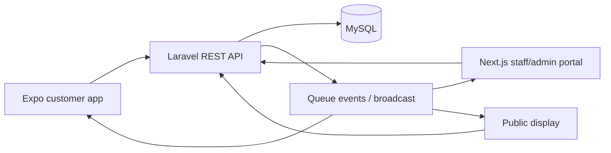

# Architecture and contracts

## System boundary

The Laravel API is the source of truth for ordering, ticket status, estimates, role checks, and audit history. The apps render server state and send commands; they do not perform queue transitions locally. Start with REST polling if needed, then add Laravel Reverb or Pusher for live events.

## Planned data model

`users`, `roles`, `branches`, `services`, `counters`, `staff_assignments`, `queues`, `tickets`, `ticket_status_history`, `appointments`, `notifications`, `branch_operating_hours`, `holidays`, `reviews`, and `activity_logs`.

Important relationships: a branch has services/counters/queues and an IANA timezone; a ticket belongs to a queue, service, branch, and customer; staff assignments link users to branch/counter; each ticket transition creates `ticket_status_history`. Store status, priority, timestamps, counter, and actor IDs explicitly. Keep public ticket numbers scoped to a branch/service queue/local date while internal IDs remain globally unique. “Join now” enters `Waiting`; scheduled tickets enter `Reserved` until check-in. All stored timestamps use UTC.

## API foundation and Sprint 1 surface

`GET /api/v1/health` returns `{"data":{"status":"ok","database":"up"}}` when the database responds. A database failure returns HTTP 503 with `{"error":{"code":"database_unavailable","message":"The database is unavailable.","details":{}}}`. Other API errors use the same `error` object, stable machine-readable codes, and safe messages. Validation failures will place field errors in `details`; server errors omit internal exception text. `/up` remains Laravel's process health route. The health route checks the database as well as the process.

The API is versioned under `/api/v1`. Sprint 1 uses Sanctum bearer tokens for both clients. Managers can only read and update assigned branches; counter staff use the assigned-counter endpoint and cannot enter branch configuration.

| Method/path | Purpose | Access |
| --- | --- | --- |
| `POST /api/v1/auth/login` | Issue a Sanctum token | Public |
| `GET /api/v1/auth/me` | Current account | Authenticated |
| `POST /api/v1/auth/logout` | Revoke current token | Authenticated |
| `/api/v1/branches` | Branch CRUD | Super admin; assigned manager read/update |
| `/api/v1/branches/{branch}/services` | Service CRUD | Assigned manager/admin |
| `/api/v1/branches/{branch}/counters` | Counter and service assignment CRUD | Assigned manager/admin |
| `/api/v1/branches/{branch}/operating-hours` | Weekly hours upsert/CRUD | Assigned manager/admin |
| `/api/v1/branches/{branch}/staff-assignments` | Assign managers and counter staff | Assigned manager/admin |
| `GET /api/v1/staff/counters` | Active assigned counters | Counter staff/admin |
| `GET /api/v1/customer/branches` | Search active branches with service queue summaries | Authenticated |
| `GET /api/v1/customer/branches/{branch}` | Branch details, services, waits, and availability | Authenticated |
| `POST /api/v1/tickets` | Join an open service queue | Customer |
| `GET /api/v1/tickets/active` | Current active ticket, estimate, and timeline | Ticket owner |
| `GET /api/v1/tickets` | Recent ticket history | Customer |
| `GET /api/v1/tickets/{ticket}` | Ticket detail | Ticket owner/admin |
| `POST /api/v1/tickets/{ticket}/cancel` | Cancel a waiting ticket and append history | Ticket owner |

## Queue numbering and estimates

Each service receives one `queues` row per branch-local date. Joining locks the customer, service, and daily queue in a database transaction before reading and incrementing `next_sequence`. Public numbers use the service code and a padded daily sequence, while the internal ticket ID remains global. A customer can hold only one active ticket.

The API derives people ahead from earlier active ticket sequences and returns the initial formula using active, unpaused counters. When no counter is active, the estimate is `null` with an explanation. Ticket creation, cancellation, and every staff command append immutable rows to `ticket_status_history` with the actor, before/after status, reason, and timestamp.

## Staff queue and live status API surface

| Method/path | Purpose | Role |
| --- | --- | --- |
| `GET /api/v1/staff/counters` | Assigned active counters | Staff/manager/admin |
| `GET /api/v1/staff/counters/{counter}/queue` | Current, waiting, and skipped ticket snapshot | Authorized staff |
| `POST /api/v1/staff/counters/{counter}/call-next` | Atomically select and call the next eligible ticket | Authorized staff |
| `POST /api/v1/staff/counters/{counter}/pause` | Pause or resume an idle counter | Authorized staff |
| `POST /api/v1/staff/counters/{counter}/tickets/{ticket}/{action}` | Recall, serve, skip, restore, or complete | Authorized staff |
| `GET /api/v1/dashboard/{branch}` | Live branch metrics and activity | Manager/admin |
| `GET /api/v1/public/branches/{branch}/display` | Called/serving and upcoming numbers without customer data | Public |

`call-next` locks the counter and selected ticket inside a database transaction. Eligibility uses the recorded priority order and waiting time. A counter cannot claim another ticket while one is called or serving. Restore moves a skipped ticket to the back with `restored` priority and is allowed once. The portal, mobile ticket, dashboard, and display poll the API; a later sprint can replace polling with broadcasts without changing transition ownership.

## Advanced service flow API

| Method/path | Purpose | Role |
| --- | --- | --- |
| `GET/POST /api/v1/appointments` | List or reserve a scheduled visit for one to five visitors | Customer |
| `POST /api/v1/tickets/{ticket}/check-in` | Activate a reserved ticket after scanning the branch QR | Ticket owner |
| `POST /api/v1/tickets/{ticket}/transfer` | Return a called/serving ticket to waiting for a compatible target counter | Assigned staff/manager/admin |
| `POST /api/v1/tickets/{ticket}/priority` | Set emergency, accessibility, or standard priority with a reason | Branch manager/admin |
| `POST /api/v1/device-tokens` | Upsert the signed-in user's Expo push token | Authenticated |

Scheduled tickets are issued immediately in `Reserved` with `scheduled` priority. The arrival window opens 30 minutes before the appointment and closes 15 minutes after it. A late attempt changes the appointment to `missed`, cancels the ticket, and records a `late_arrival` event. Branch QR signs encode `queuecare://branch/{branch_id}`; the mobile app verifies the branch before submitting the ticket's private check-in token.

`ticket_status_history` is also the append-only audit log for `check_in`, `transfer`, `priority`, and `late_arrival` events. Transfer records source and target counter IDs. Priority changes record old and new tiers. Both require a non-empty reason and actor. The target counter receives exclusive call eligibility through `preferred_counter_id` until it claims the ticket.

Notifications use a database outbox. Customer-impacting events enqueue a row inside the same database transaction as the queue change. `php artisan notifications:retry` sends due rows through Expo Push Service, applies exponential backoff after transient failures, and stops after five attempts. A notification with no registered device is retained as delivered in the in-app record. Remote push requires an Expo development/production build and an EAS project ID; Expo Go on Android does not support remote notifications for this SDK.

## Authentication and privacy

Laravel Sanctum token authentication is implemented. Role and branch scope are enforced in Laravel policies and controller boundary checks. Public displays will receive ticket numbers and counter labels only. Keep keys for Firebase, Google Maps, and broadcasts in environment variables; no secrets in client source.

## Environment plan

- Local: Next.js `3000`, API `8000`, Expo dev server, MySQL 8.4 on `127.0.0.1:3307` via Docker Compose.
- CI: MySQL 8.4 service for migration verification; PHPUnit uses SQLite in memory for fast feature tests.
- Web: `NEXT_PUBLIC_API_BASE_URL` (only the non-secret API origin).
- Mobile: `EXPO_PUBLIC_API_BASE_URL` set to a LAN-reachable API address during device testing.
- API: database, app URL, Sanctum stateful domains/CORS, and outbound HTTPS access to Expo Push Service.
- Mobile: set `extra.eas.projectId` through EAS configuration before testing remote push on a physical development build.
