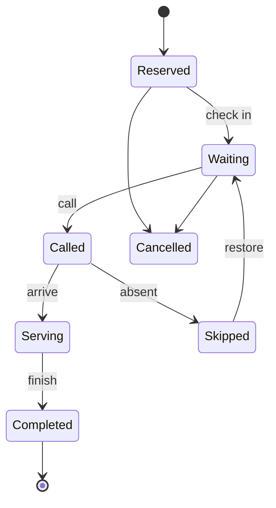

# Product scope

## Goal and users

Customers reserve a number and track the wait. Staff operate counters. Branch managers configure branches and monitor performance. Super admins oversee the platform. A public display shows calls without exposing customer details.

## Experience direction

The approved platform design is **Concept 11 — Modular Bento**. Use confident cobalt blue, deep navy typography, pale blue backgrounds, rounded modular cards, and restrained mint, amber, and violet accents. Queue status and the primary action must remain more prominent than decoration. Apply the shared visual language across mobile, staff/admin web, and public display as specified in `DESIGN.md`.

## Phase 1: MVP

1. Account sign-in and role-based access for customer, staff, branch manager, and super admin.
2. Branches, operating hours, services, counters, and staff assignments.
3. Customer branch list/detail, join queue, active digital ticket, and ticket cancellation.
4. Staff waiting list, call, recall, start serving, skip, complete, and counter pause/close.
5. Live status updates, a basic branch dashboard, and a minimal public display.
6. Audit records for every ticket transition and manual priority change.

MVP acceptance: a customer can join an open branch queue, a staff member can serve the ticket through completion, both clients see consistent status, and a manager can inspect the event history.

## Phase 2

QR arrival check-in; scheduled visits; push notifications; transfers; controlled priority changes; reports/CSV/PDF; Khmer and English.

## Phase 3

Dark mode; refined animations; richer public display; automated tests and API docs; demo data/accounts; deployment and demonstration video.

## Core ticket states

**Sprint 0 policy:** “Join now” creates a `Waiting` ticket immediately, including when the customer is remote. `Reserved` is for scheduled visits in Phase 2; a scheduled ticket becomes `Waiting` only when the customer checks in during the branch's arrival window. QR check-in is an optional arrival method in Phase 2 and does not block MVP remote joining. If a called customer is absent, staff may skip after a two-minute grace period; the MVP has no automatic cancellation of a waiting ticket. A skipped ticket can be restored once to the lowest priority tier. These rules keep the MVP usable without requiring location or QR access.

## Queue rules

Priority order: emergency; accessibility (elderly, pregnant, or disabled); scheduled appointment; standard walk-in; restored skipped ticket. Priority changes require actor, reason, old/new priority, and timestamp in an append-only audit event. Use server time for sequencing; define tie-breakers by check-in time and ticket ID.

Emergency priority requires a branch manager or super admin and a recorded reason. Staff may not silently reorder tickets. Within the same priority tier, order by the time a ticket entered `Waiting`, then its internal ID. Restoring a skipped ticket records a new waiting timestamp.

Each branch stores an IANA timezone, such as `Asia/Phnom_Penh` for a demo branch. Store timestamps in UTC; evaluate hours, holidays, appointments, and the daily ticket reset in the branch timezone. Public numbers reset at local midnight and are unique within branch + service queue + local date. Internal ticket IDs never reset.

MVP joins are for one visitor. Phase 2 group bookings may hold one ticket for up to five visitors; the service duration estimate must account for group size rather than treating the group as five separate tickets.

Initial estimate: `people_ahead × average_service_minutes ÷ active_counters`. Return `null` with an explanation when no counter is active; never divide by zero. The estimate is informational, not a promised appointment time.
